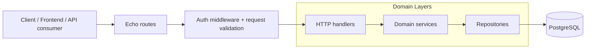

# SpotSync

**Smart Parking & EV Charging Reservation**

A centralized platform for busy airports and malls to manage parking zones, with a focus on high-demand reservation of limited EV charging spots.

Live URL: https://spotsync-api.vercel.app

## Overview

SpotSync is a Go and Echo-based REST API for managing users, parking zones, and reservations. It supports role-based access for admin and driver users, JWT authentication, PostgreSQL persistence, and database-backed capacity checks so reservations stay within the available number of spots.

## Features

- User registration and login with JWT authentication.
- Role-based access control for `admin` and `driver` users.
- Parking zone management with support for general, covered, and EV charging zones.
- Reservation creation, cancellation, and retrieval of personal reservation history.
- Capacity-aware reservation handling to prevent overbooking.
- Validation, structured JSON responses, and GORM-based PostgreSQL persistence.

## Tech Stack

- Go
- Echo v5
- GORM
- PostgreSQL
- JWT
- go-playground/validator
- godotenv

## Architecture

The codebase follows a layered structure to keep HTTP concerns, business rules, and persistence separate.



Request flow:

1. Echo receives the HTTP request and routes it to the correct handler.
2. Middleware validates the `Authorization: Bearer <token>` header when a route is protected.
3. Handlers bind and validate request payloads, then call the domain service.
4. Services apply business rules such as reservation ownership and zone capacity.
5. Repositories handle data access through GORM.
6. PostgreSQL stores users, parking zones, and reservations.

## Setup

### Prerequisites

- Go 1.26.4 or a compatible version declared by the project.
- PostgreSQL database.

### Environment Variables

Create a `.env` file in the project root with:

```env
PORT=8080
DSN="host=YOUR_HOST user=YOUR_USER password=YOUR_PASSWORD dbname=spotsync port=5432 sslmode=disable TimeZone=Asia/Shanghai"

JWT_SECRET=your-strong-secret
```

### Run Locally

```bash
go mod download
go run ./cmd
```

The server starts on the port defined in `PORT`. On startup it auto-migrates the database models for users, parking zones, and reservations.

### Authentication

Protected endpoints require this header:

```http
Authorization: Bearer <your-jwt-token>
```

## API Endpoints

Base path: `/api/v1`

### Health Check

| Method | Endpoint | Auth | Description |
| --- | --- | --- | --- |
| GET | `/` | No | Basic server health check. |

### Authentication

| Method | Endpoint | Auth | Description |
| --- | --- | --- | --- |
| POST | `/auth/register` | No | Register a new user. |
| POST | `/auth/login` | No | Login and receive a JWT token. |

Register payload:

```json
{
	"name": "Alex Johnson",
	"email": "alex@example.com",
	"password": "strong-password",
	"role": "driver"
}
```

Login payload:

```json
{
	"email": "alex@example.com",
	"password": "strong-password"
}
```

### Parking Zones

| Method | Endpoint | Auth | Roles | Description |
| --- | --- | --- | --- | --- |
| POST | `/zones` | Yes | `admin` | Create a parking zone. |
| GET | `/zones` | No | - | Get all parking zones. |
| GET | `/zones/:id` | No | - | Get a parking zone by ID. |

Create parking zone payload:

```json
{
	"name": "Terminal A EV Charging",
	"type": "ev_charging",
	"total_capacity": 12,
	"price_per_hour": 8.5
}
```

### Reservations

| Method | Endpoint | Auth | Roles | Description |
| --- | --- | --- | --- | --- |
| POST | `/reservations` | Yes | `admin`, `driver` | Create a reservation for a parking zone. |
| GET | `/reservations/my-reservations` | Yes | `admin`, `driver` | Get the authenticated user’s reservations. |
| DELETE | `/reservations/:id` | Yes | `admin`, `driver` | Cancel a reservation. |
| GET | `/reservations` | Yes | `admin` | Get all reservations. |

Create reservation payload:

```json
{
	"zone_id": 1,
	"license_plate": "ABC-1234"
}
```

## Project Structure

```text
cmd/                     Application entrypoint
internal/config/         Environment and database configuration
internal/auth/           JWT utilities
internal/middlewares/    HTTP middleware
internal/server/         Echo server bootstrap and route registration
internal/domain/user/    User domain logic, handlers, repository, DTOs
internal/domain/parking/ Parking zone domain logic, handlers, repository, DTOs
internal/domain/reservation/ Reservation domain logic, handlers, repository, DTOs
internal/httpResponse/   Shared API response shapes
```

## Notes

- Reservation creation is protected by a capacity check so a zone cannot be oversold.
- The API returns JSON responses consistently for success and error cases.
- The service layer is the right place to add new business rules without changing the HTTP layer.
